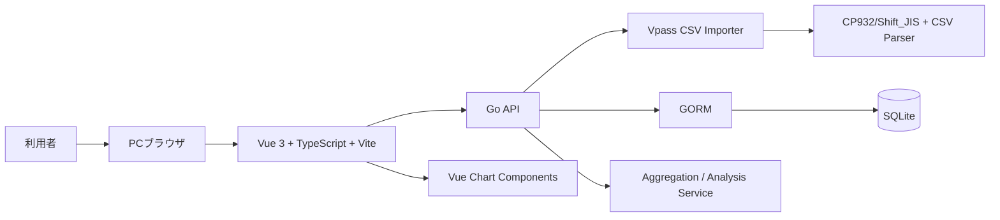
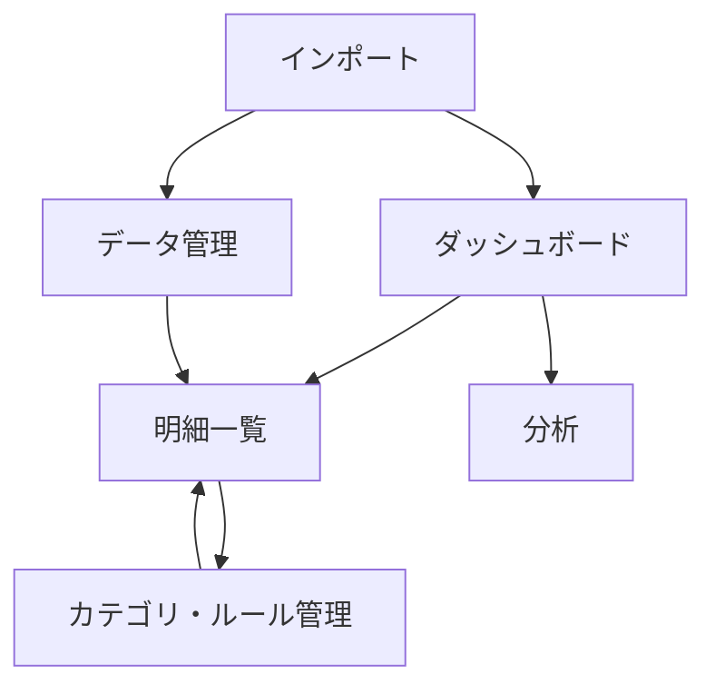
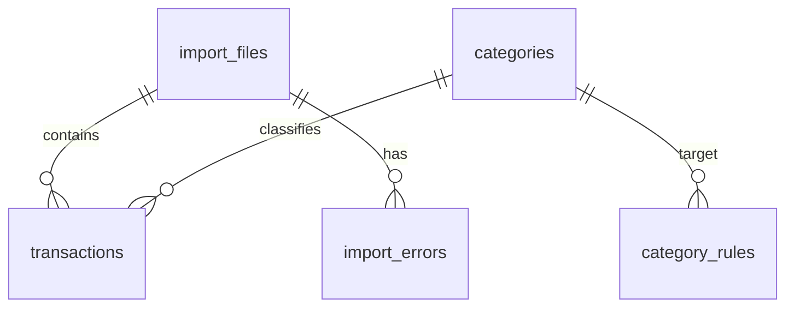
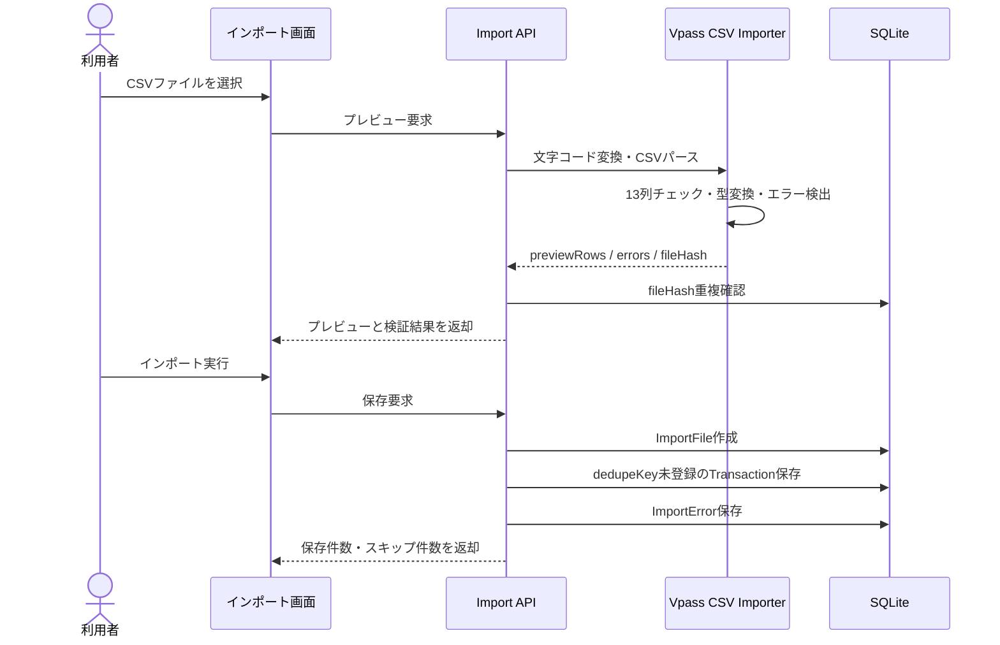

# Vpass明細分析アプリ 概要設計書

## 1. 設計方針

### 1.1 目的

Vpassからエクスポートしたクレジットカード利用明細CSVを、ローカル環境で安全に取り込み、月別・利用先別・カテゴリ別に支出傾向を分析できるWebアプリとして設計する。

主な目的は以下とする。

- Vpass CSVをCP932/Shift_JIS系のヘッダーなしCSVとして正しく取り込む
- 明細データを外部サービスへ送信せず、ローカルDBで管理する
- 月別支出、利用先別ランキング、カテゴリ別内訳を素早く確認できる
- 利用先名に基づく分類ルールを蓄積し、分析の手間を減らす
- 将来的に他カードCSVや銀行CSVを追加できる拡張性を残す

### 1.2 前提

確定要件:

- 初期版は本人のみが利用するローカルWebアプリとする
- PC版ChromeまたはEdgeの最新版を主対象とする
- 認証、複数ユーザー、クラウド同期は初期スコープ外とする
- Vpass CSVはCP932/Shift_JIS系、ヘッダーなし、1行13列の固定形式を初期想定とする
- データ保存はSQLiteを基本とする
- フロントエンドはVue 3 + TypeScript + Viteを基本とする
- バックエンドはGo API、ORMはGORM、DBはSQLiteを基本とする

設計上の仮定:

- 仮定: 集計の主軸は初期状態では「請求金額」とし、画面上で「利用金額」と切り替え可能にする余地を残す
- 仮定: 月別集計は初期状態では「支払月」ベースとし、「利用日」ベースは分析条件として拡張可能にする
- 仮定: CSVファイルはブラウザからアップロードし、サーバー側で文字コード変換・パース・保存を行う
- 仮定: ローカル実行を前提とするため、外部APIやクラウドストレージは使用しない

### 1.3 スコープ

MVPスコープ:

- Vpass CSVアップロード
- CP932/Shift_JIS系CSVの読み込み
- ヘッダーなし13列CSVの列番号マッピング
- インポート前プレビュー
- 不正行、列数不足、金額変換エラーの表示
- 重複インポート防止
- SQLiteへの明細保存
- 明細一覧、検索、フィルタ、並び替え
- 月別支出合計
- 利用先別ランキング
- カテゴリ作成・編集・削除
- 明細へのカテゴリ手動設定
- 利用先名に基づく分類ルール作成
- 既存明細への分類ルール再適用

### 1.4 初期スコープ外

- 銀行口座や証券口座との自動連携
- Vpassへの自動ログインやスクレイピング
- スマートフォンアプリ化
- 複数ユーザー対応
- クラウド同期
- AIによる自動分類
- レシート読み取り
- 予算管理

## 2. 全体アーキテクチャ

### 2.1 システム構成



### 2.2 技術スタック

| 領域 | 採用方針 | 理由 |
|---|---|---|
| フロントエンド | Vue 3 + TypeScript + Vite | 実務スタックに寄せつつ、ローカルWebアプリとして画面追加しやすい |
| スタイリング | Tailwind CSS | ダッシュボードやテーブルUIを素早く構築できる |
| バックエンド | Go | CSV処理、文字コード変換、SQLite保存、集計APIを堅実に実装しやすい |
| CSVパース | Go標準 `encoding/csv` + `golang.org/x/text/encoding/japanese` | CP932/Shift_JIS対応とヘッダーなしCSV処理をバックエンドに集約するため |
| データ保存 | SQLite | 本人利用のローカルアプリに向いており、導入が軽い |
| ORM | GORM | GoでSQLiteを扱いやすく、モデル定義とCRUDを簡潔に実装できる |
| グラフ | Chart.js系VueラッパーまたはECharts | Vueで月次・カテゴリ別グラフを実装しやすい |

### 2.3 採用理由

- 明細データは金融情報に近いため、外部送信しないローカル保存を優先する
- Vpass CSV固有の文字コード・列定義はインポーターに閉じ込め、将来のCSV追加に備える
- Go + GORM + SQLiteにより、ローカル実行でも履歴・分類ルール・集計を扱いやすくする
- Vue 3 + TypeScript + Viteにより、実務スタックに近い形で画面開発を進められる
- 分類ルールを明細データと分離し、再適用やルール改善をしやすくする

### 2.4 クライアント / サーバー責務分担

| 領域 | クライアント責務 | サーバー責務 |
|---|---|---|
| CSVアップロード | ファイル選択、プレビュー表示、実行操作 | 文字コード変換、CSVパース、検証、DB保存 |
| 明細一覧 | 検索条件入力、テーブル表示、カテゴリ変更操作 | 検索、フィルタ、並び替え、更新処理 |
| ダッシュボード | 月選択、グラフ表示 | 月別・利用先別・カテゴリ別集計 |
| カテゴリ管理 | カテゴリ/ルール編集UI | ルール保存、再適用、整合性チェック |
| データ管理 | エクスポート/削除操作 | ファイル単位削除、バックアップ用エクスポート |

## 3. 画面設計

### 3.1 画面一覧

| 画面 | 目的 | 主な要素 |
|---|---|---|
| インポート画面 | Vpass CSVを読み込み、保存前に検証する | アップロード、プレビュー、エラー行一覧、インポート履歴 |
| ダッシュボード画面 | 月ごとの支出状況を把握する | 月選択、支出合計、前月比、カテゴリ別グラフ、利用先ランキング、日別推移 |
| 明細一覧画面 | 明細を検索・確認・分類する | 明細テーブル、年月/利用先/カテゴリ/金額フィルタ、並び替え、カテゴリ変更 |
| カテゴリ・ルール管理画面 | 分類体系と自動分類ルールを管理する | カテゴリ一覧、色設定、ルール一覧、ルール作成、再適用 |
| 分析画面 | 長期傾向や支出パターンを見る | 月別推移、カテゴリ別推移、利用先別推移、固定費候補、少額高頻度支出 |
| データ管理画面 | インポート済みデータを管理する | インポート履歴、ファイル単位削除、データエクスポート |

### 3.2 画面遷移



### 3.3 各画面の責務

| 画面 | 責務 |
|---|---|
| インポート | CSVの読み込み、列マッピング結果の確認、エラー検出、重複判定結果の提示 |
| ダッシュボード | 支出総額、前月比、ランキング、内訳、推移を一目で確認できる状態にする |
| 明細一覧 | 明細検索、絞り込み、並び替え、カテゴリ手動補正を行う |
| カテゴリ・ルール管理 | カテゴリと利用先名ルールを独立管理し、既存明細へ再適用できるようにする |
| 分析 | 月次推移、利用先別推移、固定費候補、少額高頻度候補を確認する |
| データ管理 | インポート履歴、ファイル単位削除、エクスポートを扱う |

## 4. データ設計

### 4.1 エンティティ一覧

| エンティティ | 説明 |
|---|---|
| Transaction | Vpass明細1行を正規化して保存する |
| ImportFile | インポートしたCSVファイル単位の履歴を管理する |
| Category | 支出カテゴリを管理する |
| CategoryRule | 利用先名に基づく分類ルールを管理する |
| ImportError | インポート時の不正行・変換エラーを記録または一時保持する |
| AppSetting | 集計基準や表示設定など、アプリ設定を保持する |

### 4.2 主要テーブル

| テーブル | 主な項目 |
|---|---|
| transactions | id, sourceFileId, usageDate, merchantName, cardUser, paymentMethod, billingMonth, usageAmount, billedAmount, categoryId, rawColumns, dedupeKey, createdAt, updatedAt |
| import_files | id, fileName, fileHash, rowCount, importedAt |
| categories | id, name, color, createdAt, updatedAt |
| category_rules | id, matchType, pattern, categoryId, priority, createdAt, updatedAt |
| import_errors | id, sourceFileId, rowNumber, errorType, message, rawColumns, createdAt |
| app_settings | id, key, value, updatedAt |

### 4.3 主なリレーション



### 4.4 制約・保持方針

- `ImportFile.fileHash` で同一ファイルの再インポートを検出する
- `Transaction.dedupeKey` で明細単位の重複登録を防ぐ
- `dedupeKey` は、初期案として `usageDate + merchantName + cardUser + paymentMethod + billingMonth + usageAmount + billedAmount` から生成する
- `rawColumns` にはVpass CSVの元13列をJSONとして保持し、将来の再解釈に備える
- `CategoryRule.priority` により複数ルール一致時の適用順を制御する
- カテゴリ削除時は、紐づく明細の `categoryId` を未分類へ戻す
- ファイル単位削除時は、対象 `ImportFile` に紐づく `Transaction` と `ImportError` を削除対象とする

## 5. 処理設計

### 5.1 主要ユースケース

| UC | 概要 | 関連画面 | 主な処理 |
|---|---|---|---|
| UC-1 | Vpass CSVをインポートする | インポート | 文字コード変換、パース、検証、プレビュー、保存 |
| UC-2 | 明細を検索・確認する | 明細一覧 | フィルタ、検索、並び替え、ページング |
| UC-3 | 月別支出を確認する | ダッシュボード | 月別集計、前月比、ランキング、グラフ |
| UC-4 | カテゴリと分類ルールを管理する | カテゴリ・ルール管理 | ルール作成、手動分類、再適用 |
| UC-5 | 分析結果を見る | 分析 | 月次推移、固定費候補、少額高頻度支出候補 |
| UC-6 | データを管理する | データ管理 | 履歴確認、ファイル単位削除、エクスポート |

### 5.2 主要処理フロー

#### CSVインポートフロー



#### 分類ルール適用フロー

1. ルールを `priority` 昇順で取得する
2. 対象明細の `merchantName` に対して `matchType` と `pattern` を評価する
3. 最初に一致したルールの `categoryId` を明細へ設定する
4. 手動設定済みカテゴリを上書きするかどうかは再適用時のオプションとする
5. 適用件数、変更件数、未分類件数を表示する

#### ダッシュボード集計フロー

1. 対象月と集計基準を受け取る
2. `billingMonth` または `usageDate` で対象明細を抽出する
3. `billedAmount` または `usageAmount` を集計対象にする
4. 合計、前月比、利用先別、カテゴリ別、日別推移を算出する
5. グラフ表示用の系列データに変換して返す

### 5.3 API / バックエンド処理方針

| 処理 | 方針 |
|---|---|
| CSVプレビュー | DB保存前に文字コード変換、列数検証、型変換、重複候補検出を行う |
| CSV保存 | `ImportFile` と `Transaction` をトランザクションで保存する |
| 重複判定 | ファイル単位は `fileHash`、明細単位は `dedupeKey` を使う |
| 明細検索 | 年月、利用先、カテゴリ、金額範囲、キーワードで絞り込む |
| カテゴリ変更 | 明細単位の `categoryId` を更新する |
| ルール再適用 | 対象範囲と上書き条件を指定して一括更新する |
| 集計 | DBクエリまたはアプリケーションサービスで集計し、画面向け形式へ整形する |
| エクスポート | 明細、カテゴリ、分類ルールをJSONまたはCSVで出力できるようにする |

### 5.4 エラーハンドリング

| ケース | 処理方針 |
|---|---|
| 文字コード変換失敗 | CSV形式・文字コードが想定外であることを表示する |
| 列数不足/超過 | 行番号、列数、元データをプレビュー上に表示する |
| 日付変換エラー | 対象行を保存対象外にし、修正不能行として表示する |
| 金額変換エラー | カンマ、空文字、符号を考慮し、それでも失敗した場合はエラー行にする |
| 同一ファイル再インポート | 既に取り込み済みであることを表示し、保存を止める |
| 明細重複 | 保存時にスキップし、スキップ件数を表示する |
| DB保存失敗 | インポート全体をロールバックし、再試行可能な状態にする |

## 6. 外部インターフェース

### 6.1 外部入力

| 入力 | 内容 | 設計方針 |
|---|---|---|
| Vpass CSV | CP932/Shift_JIS系、ヘッダーなし、13列固定形式 | Vpass CSV Importerで専用処理する |
| ユーザー操作 | カテゴリ変更、ルール作成、フィルタ条件 | UIからAPIへ送信する |

### 6.2 外部出力

| 出力 | 内容 |
|---|---|
| 明細エクスポート | 保存済み明細をCSVまたはJSONで出力 |
| カテゴリエクスポート | カテゴリ定義をJSONで出力 |
| 分類ルールエクスポート | ルール定義をJSONで出力 |

### 6.3 外部サービス連携

初期版では外部サービス連携を行わない。

将来拡張時は、PayPay、銀行CSV、他カードCSVをそれぞれ独立したインポーターとして追加する。Vpassへの自動ログインやスクレイピングは初期スコープ外であり、将来検討時も利用規約・セキュリティ・保守性を再評価する。

## 7. 非機能設計

### 7.1 セキュリティ

- 明細データを外部サーバーへ送信しない
- 初期版ではローカル環境のみで動作させる
- 認証は初期スコープ外とする
- 将来的にクラウド化する場合は、認証、暗号化、バックアップ、アクセス制御を再設計する
- サンプルやログに実明細データを不用意に出力しない
- Go APIはローカルホストで起動し、初期版では外部ネットワーク公開しない

### 7.2 パフォーマンス

- 数千件程度の明細を快適に表示・検索できることを目標とする
- CSVインポートは数秒以内の完了を目標とする
- 明細一覧はページングを基本とし、必要に応じて仮想スクロールを検討する
- 検索・集計で使う `usageDate`、`billingMonth`、`merchantName`、`categoryId` にはインデックスを検討する

### 7.3 保守性

- Vpass固有の列定義、文字コード、日付/金額変換はインポーターに閉じ込める
- 分類ルールは明細データとは独立して管理する
- 集計ロジックは画面コンポーネントから分離し、分析サービスとして再利用可能にする
- 将来のCSV形式追加に備え、インポーターの共通インターフェースを用意する

### 7.4 運用・バックアップ

- SQLite DBファイルをバックアップ対象とする
- 明細、カテゴリ、分類ルールをエクスポート可能にする
- インポート履歴により、不要データをファイル単位で削除できるようにする
- DBスキーマ変更はGORM AutoMigrateまたはGo製マイグレーションツールで管理する

## 8. ディレクトリ構成案

```text
vpass-statement-analyzer/
  frontend/
    src/
      pages/
        ImportPage.vue
        DashboardPage.vue
        TransactionsPage.vue
        CategoriesPage.vue
        AnalysisPage.vue
        DataManagementPage.vue
      components/
        charts/
        tables/
        forms/
      api/
        client.ts
      types/
  backend/
    cmd/
      server/
        main.go
    internal/
      api/
      importer/
        vpass_csv_importer.go
      encoding/
      analytics/
      category/
      repository/
      model/
      database/
    migrations/
  data/
    vpass-statement-analyzer.sqlite
  docs/
  requirements.md
  overview-design.md
```

## 9. 設計上の判断

| 判断 | 内容 | 理由 |
|---|---|---|
| ローカルWebアプリ | 初期版は外部公開しない | 金融系明細データを外部送信せずに扱うため |
| Go + Vue構成 | フロントエンドとバックエンドを分離する | 実務スタックに寄せつつ、CSV処理と画面責務を明確に分けるため |
| SQLite採用 | 明細、カテゴリ、ルール、履歴をローカルDBへ保存 | 本人利用・数千件規模に対して軽量で十分なため |
| GORM採用 | Go側でSQLiteアクセスとモデル管理を行う | CRUD実装を簡潔にし、Go API内でDB責務を完結させるため |
| Vpass専用Importer | 文字コード、ヘッダーなし13列、列マッピングを専用モジュールに分離 | 他CSV追加時に影響範囲を限定するため |
| プレビュー後保存 | CSVを即保存せず、検証結果を見せてから保存する | 不正行や文字化け、列ズレを早期発見するため |
| 二段階重複判定 | ファイル単位と明細単位で重複を防ぐ | 同じCSV再投入と複数CSV間の重複の両方を避けるため |
| 分類ルール分離 | CategoryRuleをTransactionから独立管理 | ルール改善と再適用を可能にするため |
| AI分類は初期対象外 | ルールベース分類をMVPにする | ローカル・軽量・説明可能な分類を優先するため |

## 10. 未決事項

| 項目 | 確認内容 | 設計への影響 |
|---|---|---|
| 主集計金額 | 利用金額と請求金額のどちらを主集計にするか | ダッシュボード、分析、ランキングの基準が変わる |
| 月次集計基準 | 支払月ベースか利用日ベースか | 月別推移、前月比、固定費判定の基準が変わる |
| 初期カテゴリ | コンビニ、スーパー、交通、外食、サブスクなどをどう分けるか | 初期データ、ルール例、画面表示が変わる |
| Suicaチャージ | 交通費か電子マネーチャージか | カテゴリ分類ルールと分析解釈が変わる |
| デスクトップアプリ化 | ローカルWebアプリのままか、将来デスクトップ化するか | 配布方法、DB保存場所、バックアップ導線が変わる |
| 手動分類の優先度 | ルール再適用時に手動カテゴリを上書きするか | 再適用処理とユーザー確認UIが変わる |

## 11. 要件トレーサビリティ

| 要件 | 設計での反映 |
|---|---|
| CP932/Shift_JIS CSV読み込み | Vpass CSV Importer、Encoding処理、CSVプレビュー |
| ヘッダーなし13列マッピング | インポーターの列番号ベース変換、`rawColumns`保持 |
| 不正行・金額変換エラー表示 | ImportError、プレビュー画面、エラーハンドリング |
| 重複登録防止 | `fileHash`、`dedupeKey`、保存時スキップ |
| 明細一覧 | 明細一覧画面、transactionsテーブル、検索/フィルタAPI |
| ダッシュボード | 集計サービス、月別合計、前月比、ランキング、グラフ |
| カテゴリ管理 | Category、CategoryRule、カテゴリ・ルール管理画面 |
| ルール再適用 | 分類ルール適用フロー、上書きオプション |
| 分析機能 | 分析画面、月次推移、固定費候補、少額高頻度候補 |
| ローカルDB保存 | SQLite、GORM、バックアップ/エクスポート方針 |
| ファイル単位削除 | ImportFile、ファイル単位削除処理 |
| 外部送信しない | ローカルWebアプリ、外部サービス連携なし |
| 将来CSV追加 | インポーター分離、共通インターフェース |

## 12. 次の開発ステップ

1. 集計基準を決める: 請求金額/利用金額、支払月/利用日
2. Go APIのプロジェクト構成とGORMモデルを作成する
3. Vue 3 + TypeScript + Viteのフロントエンドを作成する
4. Vpass CSV Importerの最小実装を作る
5. CSVプレビューAPIとインポート画面を作る
6. SQLite保存と重複判定を実装する
7. 明細一覧APIと明細一覧画面を作る
8. 月別合計と利用先ランキングを実装する
9. カテゴリ管理と手動分類を追加する
10. 分類ルール作成と再適用を実装する
11. グラフと分析画面を追加する
