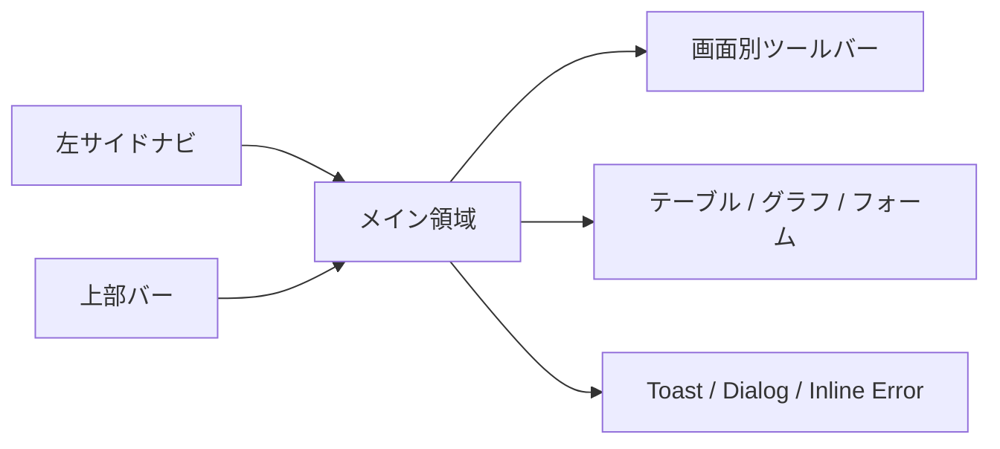
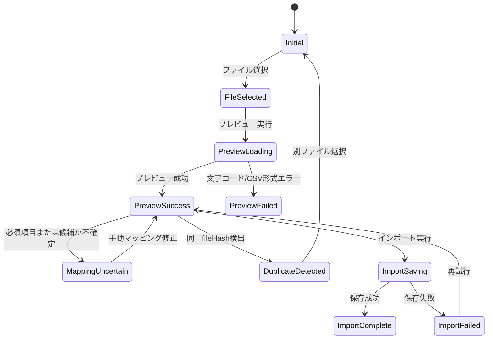

# Vpass明細分析アプリ UI設計書

## 1. UI設計方針

### 1.1 目的

Vpass明細CSVをローカル環境で取り込み、明細確認・分類・集計・分析を効率よく行うための画面仕様を定義する。

本書は [overview-design.md](./overview-design.md)、[api-design.md](./api-design.md)、[openapi.yaml](./openapi.yaml) をもとに、Vue 3 + TypeScript + Vite で実装しやすい粒度まで UI 構造、状態、操作、API 対応を整理する。

### 1.2 前提

- 初期版は本人のみが利用するローカルWebアプリ
- PC版 Chrome / Edge 最新版を主対象とする
- 認証、複数ユーザー、クラウド同期は扱わない
- UIは業務・分析ツールとして、密度高めだが読みやすい構成にする
- ランディングページや説明用ヒーローは作らず、初期表示から実作業に入れる構成にする
- Vpass CSV の列数は固定しない
- CSVマッピングは候補提示と手動補正を前提にする
- APIの Base URL は `http://localhost:8080`

### 1.3 UIトーン

- 金融明細を扱うため、派手な装飾よりも視認性、誤操作防止、確認しやすさを優先する
- 色は状態表現に使う: success / warning / error / selected / muted
- テーブル、フィルタ、フォームは繰り返し操作しやすい密度にする
- 画面内説明文は最小限にし、ラベル、状態、エラー文で操作意図が分かるようにする

## 2. ナビゲーション

### 2.1 画面一覧

| 画面 | ルート案 | 目的 |
|---|---|---|
| インポート | `/imports/new` | CSVをプレビューし、確認後に保存する |
| ダッシュボード | `/dashboard` | 月次の支出状況を把握する |
| 明細一覧 | `/transactions` | 明細を検索・確認・分類する |
| カテゴリ・ルール管理 | `/categories` | カテゴリと分類ルールを管理する |
| 分析 | `/analytics` | 長期傾向、固定費候補、少額高頻度支出を確認する |
| データ管理 | `/data` | インポート履歴、削除、エクスポートを扱う |
| 設定 | `/settings` | 集計基準などを変更する |

### 2.2 基本レイアウト

| 領域 | 内容 |
|---|---|
| 左サイドナビ | 主要画面への移動。現在画面を強調表示する |
| 上部バー | アプリ名、現在のDB/ローカル状態、必要に応じて最終インポート時刻 |
| メイン領域 | 画面ごとの作業領域 |
| Toast | 保存成功、エクスポート開始/完了などの軽量通知 |
| Dialog | 削除、再適用、インポート実行などの確認 |

初期表示は、保存済み明細がない場合はインポート画面、明細がある場合はダッシュボードを想定する。

## 3. 共通UI状態

| 状態 | 表示方針 |
|---|---|
| loading | テーブルは skeleton、グラフはローディングプレースホルダー、ボタンは disabled |
| empty | 次に行う操作へ誘導する。例: 「CSVをインポート」ボタン |
| error | 画面上部または対象領域に再試行可能なエラーを表示する |
| validation | 入力項目の直下にエラー、フォーム上部に件数サマリー |
| success | Toastまたは結果サマリー。重要な完了は画面内に残す |
| destructive confirmation | 対象名、影響件数、取り消し可否、実行後遷移を明示する |

## 4. インポート画面

### 4.1 目的

Vpass CSVをアップロードし、保存前に文字コード、列マッピング、必須項目、変換エラー、重複を確認する。

### 4.2 レイアウト

| 領域 | 内容 |
|---|---|
| ステップヘッダー | `1. ファイル選択` → `2. プレビュー確認` → `3. 保存結果` |
| ファイル選択 | CSVファイル選択、対応形式表示 |
| 検出結果 | encoding、detectedFormat、hasHeader、duplicateFile |
| マッピング確認 | CSV列、サンプル値、取込先項目、手動変更 |
| CSV行プレビュー | CSVの先頭行を元の列順で表示。空列もカンマ位置で確認できるようにする |
| エラー一覧 | rowNumber、errorType、message、rawColumns |
| 実行フッター | インポート実行、戻る、キャンセル |

### 4.3 インポート状態遷移

### 4.4 マッピングUI

列数は固定しない。以下をテーブルで表示する。

| 列 | 内容 |
|---|---|
| sourceColumnIndex | 0始まりの列番号 |
| sourceColumnName | ヘッダーがある場合の列名。ない場合は `列 1` のように表示 |
| sampleValues | その列の先頭数行の値。どの項目に対応させるか判断するための確認用 |
| targetField | `usageDate`、`merchantName`、`billingMonth` など |
| required | 必須項目か |
| action | targetFieldの手動変更 |

必須項目:

- `usageDate`
- `merchantName`
- `billingMonth`
- `usageAmount` または `billedAmount`

必須項目が不足する場合は、保存ボタンを disabled にし、マッピングテーブル上部に不足項目を表示する。

### 4.5 主な状態

| 状態 | 表示 |
|---|---|
| 初期 | ファイルドロップ領域、対応形式、過去インポートへの導線 |
| loading | 「CSVを解析しています」、ファイル名、progress 表示 |
| preview success | 検出結果、マッピング候補、プレビュー行、保存ボタン |
| mapping uncertain | 未確定 badge、不足項目サマリー、手動選択必須 |
| validation error | エラー行一覧、保存不可 |
| duplicate detected | 同一ファイルとして保存済みであることを警告、保存不可 |
| saving | 保存ボタン disabled、キャンセル不可、処理中表示 |
| complete | 保存件数、重複スキップ件数、エラー件数、明細一覧/ダッシュボードへの導線 |
| failed | エラー内容、再試行、別ファイル選択 |

### 4.6 利用API

| 操作 | API |
|---|---|
| CSVプレビュー作成 | `createImportPreview` / `POST /import-previews` |
| CSV保存 | `createImport` / `POST /imports` |
| インポート履歴取得 | `listImports` / `GET /imports` |

## 5. ダッシュボード画面

### 5.1 目的

対象月の支出状況を短時間で把握する。

### 5.2 レイアウト

| 領域 | 内容 |
|---|---|
| 条件バー | 月、集計日付基準、集計金額基準 |
| KPI | 支出合計、前月比、明細件数 |
| 月別支出推移 | 請求月ごとの支出額を Chart.js の棒グラフで表示 |
| 日別推移 | 折れ線または棒グラフ |
| カテゴリ内訳 | ドーナツまたは横棒グラフ |
| 利用先ランキング | 上位利用先テーブル |
| 導線 | 明細一覧で見る、分析へ移動 |

既定値は `basisDate=billingMonth`、`basisAmount=billedAmount` とする。

### 5.3 主な状態

| 状態 | 表示 |
|---|---|
| 初回empty | 「まずCSVをインポートしてください」、インポート画面へのボタン |
| 対象月empty | 対象月に明細がないことを表示し、月変更を促す |
| loading | KPI skeleton、グラフ placeholder |
| error | 集計取得失敗、再読み込み |

### 5.4 利用API

| 操作 | API |
|---|---|
| 月次サマリー取得 | `getMonthlySummary` / `GET /summaries/monthly` |
| 利用先別ランキング取得 | `getMerchantSummary` / `GET /summaries/merchants` |
| カテゴリ別内訳取得 | `getCategorySummary` / `GET /summaries/categories` |
| 設定取得 | `getSettings` / `GET /settings` |

## 6. 明細一覧画面

### 6.1 目的

保存済み明細を検索、確認、カテゴリ補正する。

### 6.2 レイアウト

| 領域 | 内容 |
|---|---|
| フィルタバー | 請求月、利用日範囲、利用先、カテゴリ、金額範囲、キーワード |
| 集計ミニ表示 | 検索結果件数、合計金額 |
| 明細テーブル | 利用日、利用先、支払月、利用金額、請求金額、カテゴリ、メモ |
| ページング | page、pageSize |
| 詳細ドロワー | rawColumns、importFile、dedupeKey、更新履歴相当 |

### 6.3 テーブル操作

| 操作 | 仕様 |
|---|---|
| ソート | 利用日、請求月、金額、利用先 |
| フィルタ | フィルタ変更時に page を 1 に戻す |
| カテゴリ変更 | カテゴリセルから combobox で変更 |
| メモ変更 | 詳細ドロワーまたはインライン編集 |
| 分析除外 | `excludedFromAnalytics` を切り替える |

カテゴリ変更は optimistic update 可。ただし失敗時は元の値へ戻し、行内エラーを表示する。

### 6.4 主な状態

| 状態 | 表示 |
|---|---|
| loading | skeleton rows |
| empty | 条件に一致する明細がない。フィルタ解除ボタン |
| first empty | インポート画面への導線 |
| update saving | 対象セルだけ pending |
| update failed | 対象行にエラー、再試行 |

### 6.5 利用API

| 操作 | API |
|---|---|
| 明細検索 | `listTransactions` / `GET /transactions` |
| 明細詳細取得 | `getTransaction` / `GET /transactions/{transactionId}` |
| 明細更新 | `updateTransaction` / `PATCH /transactions/{transactionId}` |
| カテゴリ一覧取得 | `listCategories` / `GET /categories` |

## 7. カテゴリ・ルール管理画面

### 7.1 目的

支出カテゴリと利用先名に基づく分類ルールを管理し、既存明細へ再適用できるようにする。

### 7.2 レイアウト

タブまたは左右分割で以下を表示する。

| 領域 | 内容 |
|---|---|
| カテゴリ一覧 | name、color、利用中件数、編集/削除 |
| カテゴリフォーム | name、color |
| 分類ルール一覧 | priority、matchType、pattern、category、編集/削除 |
| ルールフォーム | matchType、pattern、categoryId、priority |
| 再適用パネル | 対象範囲、手動カテゴリ上書き有無、実行 |

### 7.3 バリデーション

| 対象 | ルール |
|---|---|
| カテゴリ名 | 空不可 |
| 色 | `#RRGGBB` |
| matchType | `contains` / `startsWith` / `equals` / `regex` |
| pattern | 空不可 |
| regex | 正規表現として有効 |
| categoryId | 既存カテゴリ |

### 7.4 破壊的操作

#### カテゴリ削除

| 項目 | 仕様 |
|---|---|
| 対象名 | カテゴリ名、色 |
| 影響件数 | 分かる場合は紐づく明細件数、分類ルール件数 |
| 影響 | 明細のカテゴリは未分類へ戻る |
| ボタン | `カテゴリを削除` |
| 実行中 | ボタン disabled、削除中表示 |
| 成功 | 一覧から削除、Toast |
| 失敗 | Dialog内にエラー、再試行可能 |

#### 分類ルール削除

| 項目 | 仕様 |
|---|---|
| 対象名 | pattern、matchType、カテゴリ |
| 影響 | 既存明細は即時変更されない |
| ボタン | `分類ルールを削除` |
| 成功 | 一覧から削除、Toast |

#### 分類ルール再適用

| 項目 | 仕様 |
|---|---|
| 対象名 | 分類ルール全体 |
| 影響件数 | 事前に分かる場合は対象件数を表示。不明なら「実行後に結果を表示」 |
| 重要設定 | 手動カテゴリを上書きするか |
| ボタン | `分類ルールを再適用` |
| 実行中 | ボタン disabled、処理中表示 |
| 成功 | matched/updated/unchanged/uncategorized を結果表示 |
| 失敗 | 変更有無を分かる範囲で表示し、再試行導線 |

### 7.5 利用API

| 操作 | API |
|---|---|
| カテゴリ一覧取得 | `listCategories` / `GET /categories` |
| カテゴリ作成 | `createCategory` / `POST /categories` |
| カテゴリ更新 | `updateCategory` / `PATCH /categories/{categoryId}` |
| カテゴリ削除 | `deleteCategory` / `DELETE /categories/{categoryId}` |
| 分類ルール一覧取得 | `listCategoryRules` / `GET /category-rules` |
| 分類ルール作成 | `createCategoryRule` / `POST /category-rules` |
| 分類ルール更新 | `updateCategoryRule` / `PATCH /category-rules/{categoryRuleId}` |
| 分類ルール削除 | `deleteCategoryRule` / `DELETE /category-rules/{categoryRuleId}` |
| 分類ルール再適用 | `createCategoryRuleApplication` / `POST /category-rule-applications` |

## 8. 分析画面

### 8.1 目的

月次推移、カテゴリ推移、利用先推移、固定費候補、少額高頻度支出を確認する。

### 8.2 レイアウト

| 領域 | 内容 |
|---|---|
| 条件バー | fromMonth、toMonth、basisAmount、カテゴリ、利用先 |
| 月別推移 | 折れ線/棒グラフ |
| 利用先推移 | 利用先選択 + 推移グラフ |
| カテゴリ推移 | カテゴリ選択 + 推移グラフ |
| 固定費候補 | merchantName、averageAmount、occurrenceMonths |
| 少額高頻度 | merchantName、totalAmount、count、averageAmount |

### 8.3 主な状態

| 状態 | 表示 |
|---|---|
| loading | グラフごとに skeleton |
| empty | 対象期間に分析可能な明細がない |
| error | パネル単位で再試行 |

### 8.4 利用API

| 操作 | API |
|---|---|
| 月別推移取得 | `getMonthlyTrends` / `GET /analytics/monthly-trends` |
| 利用先推移取得 | `getMerchantTrends` / `GET /analytics/merchant-trends` |
| カテゴリ推移取得 | `getCategoryTrends` / `GET /analytics/category-trends` |
| 固定費候補取得 | `listRecurringCandidates` / `GET /analytics/recurring-candidates` |
| 少額高頻度候補取得 | `listSmallFrequentTransactions` / `GET /analytics/small-frequent-transactions` |

## 9. データ管理画面

### 9.1 目的

インポート履歴の確認、ファイル単位削除、データエクスポートを行う。

### 9.2 レイアウト

| 領域 | 内容 |
|---|---|
| インポート履歴 | fileName、detectedFormat、rowCount、importedAt |
| インポート詳細 | transactionCount、errorCount、mappings、errors |
| 削除操作 | ファイル単位削除 |
| エクスポート | 明細、カテゴリ、分類ルール |

### 9.3 インポート削除確認

| 項目 | 仕様 |
|---|---|
| 対象名 | fileName、importedAt |
| 影響件数 | 詳細取得済みの場合は transactionCount、errorCount。履歴一覧のみの場合は件数表示を省略して影響範囲を文章で示す |
| 影響 | 対象ファイル由来の明細、マッピング、エラー、インポート履歴を削除。同一CSVは削除後に再インポート可能 |
| ボタン | `インポートを削除` |
| 実行中 | ボタン disabled、削除中表示 |
| 成功 | 履歴一覧へ戻り、Toast |
| 失敗 | Dialog内にエラー、再試行 |

### 9.4 エクスポート

| 操作 | 仕様 |
|---|---|
| 明細エクスポート | CSV/JSON選択、対象期間指定 |
| カテゴリエクスポート | JSON固定 |
| 分類ルールエクスポート | JSON固定 |

ダウンロード開始時は Toast、失敗時は再試行可能なエラーを表示する。

### 9.5 利用API

| 操作 | API |
|---|---|
| インポート履歴取得 | `listImports` / `GET /imports` |
| インポート詳細取得 | `getImport` / `GET /imports/{importFileId}` |
| インポート削除 | `deleteImport` / `DELETE /imports/{importFileId}` |
| 明細エクスポート | `exportTransactions` / `GET /exports/transactions` |
| カテゴリエクスポート | `exportCategories` / `GET /exports/categories` |
| 分類ルールエクスポート | `exportCategoryRules` / `GET /exports/category-rules` |

## 10. 設定画面

### 10.1 目的

集計基準など、画面表示の既定値を設定する。

### 10.2 項目

| 項目 | 値 | 初期値 |
|---|---|---|
| 集計日付基準 | `billingMonth` / `usageDate` | `billingMonth` |
| 集計金額基準 | `billedAmount` / `usageAmount` | `billedAmount` |

### 10.3 利用API

| 操作 | API |
|---|---|
| 設定取得 | `getSettings` / `GET /settings` |
| 設定更新 | `updateSettings` / `PATCH /settings` |

## 11. 画面/API対応表

| 画面 | 主な操作 | operationId |
|---|---|---|
| インポート | CSVプレビュー | `createImportPreview` |
| インポート | CSV保存 | `createImport` |
| ダッシュボード | 月次サマリー取得 | `getMonthlySummary` |
| ダッシュボード | 利用先ランキング取得 | `getMerchantSummary` |
| ダッシュボード | カテゴリ内訳取得 | `getCategorySummary` |
| 明細一覧 | 明細検索 | `listTransactions` |
| 明細一覧 | 明細詳細取得 | `getTransaction` |
| 明細一覧 | 明細更新 | `updateTransaction` |
| カテゴリ・ルール管理 | カテゴリCRUD | `listCategories`, `createCategory`, `updateCategory`, `deleteCategory` |
| カテゴリ・ルール管理 | 分類ルールCRUD | `listCategoryRules`, `createCategoryRule`, `updateCategoryRule`, `deleteCategoryRule` |
| カテゴリ・ルール管理 | 分類ルール再適用 | `createCategoryRuleApplication` |
| 分析 | 月別推移 | `getMonthlyTrends` |
| 分析 | 利用先推移 | `getMerchantTrends` |
| 分析 | カテゴリ推移 | `getCategoryTrends` |
| 分析 | 固定費候補 | `listRecurringCandidates` |
| 分析 | 少額高頻度候補 | `listSmallFrequentTransactions` |
| データ管理 | インポート履歴/詳細/削除 | `listImports`, `getImport`, `deleteImport` |
| データ管理 | エクスポート | `exportTransactions`, `exportCategories`, `exportCategoryRules` |
| 設定 | 設定取得/更新 | `getSettings`, `updateSettings` |

## 12. アクセシビリティ・レスポンシブ

### 12.1 アクセシビリティ

- フォーム項目は label と error message を関連付ける
- 色だけで状態を伝えず、badge text も併用する
- destructive action はボタン色だけでなく文言で危険性を示す
- テーブル操作は keyboard focus が見えるようにする
- Dialog は escape / cancel / confirm の操作を明確にする

### 12.2 レスポンシブ

主対象は PC だが、狭いノートPC幅でも破綻しないようにする。

| 幅 | 方針 |
|---|---|
| 1280px以上 | 左ナビ + 2カラム/複数パネル |
| 1024px前後 | 左ナビは維持、テーブル横スクロール許容 |
| 768px前後 | ナビ折りたたみ、フィルタは開閉パネル化 |

スマートフォン最適化は初期スコープ外とする。

## 13. 未決事項

| 項目 | 確認内容 | UIへの影響 |
|---|---|---|
| import preview の保持方式 | previewId の有効期限、一時ファイル/DB/再アップロード | 保存失敗時の再試行導線が変わる |
| 初期カテゴリ | 初期カテゴリを用意するか | 初回カテゴリ管理画面、明細分類体験が変わる |
| 手動分類の優先度 | 再適用時に上書きする既定値 | 再適用Dialogの初期値が変わる |
| カテゴリ削除時の影響件数 | APIで削除前に取得できるか | 確認Dialogの精度が変わる |
| エクスポート形式 | 明細の既定をCSV/JSONどちらにするか | エクスポートUIの初期値が変わる |
| グラフライブラリ | Chart.js系Vueラッパー / ECharts | グラフの表現、tooltip、凡例UIが変わる |

## 14. 実装開始時の優先順

1. 共通レイアウト、ナビゲーション、Toast/Dialog基盤
2. インポート画面のファイル選択、プレビュー、マッピング確認
3. インポート保存結果と明細一覧への導線
4. 明細一覧、フィルタ、カテゴリ変更
5. カテゴリ・分類ルール管理
6. ダッシュボード集計
7. 分析画面
8. データ管理、エクスポート、設定
